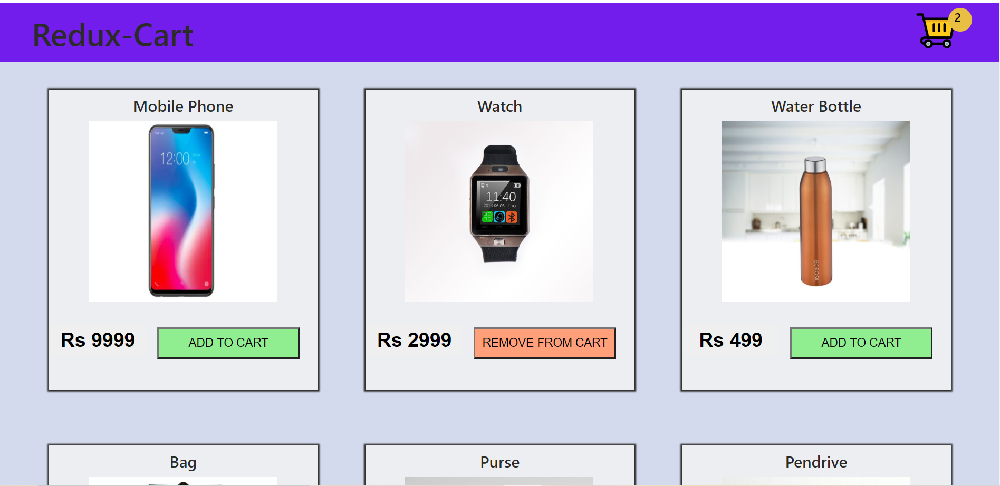
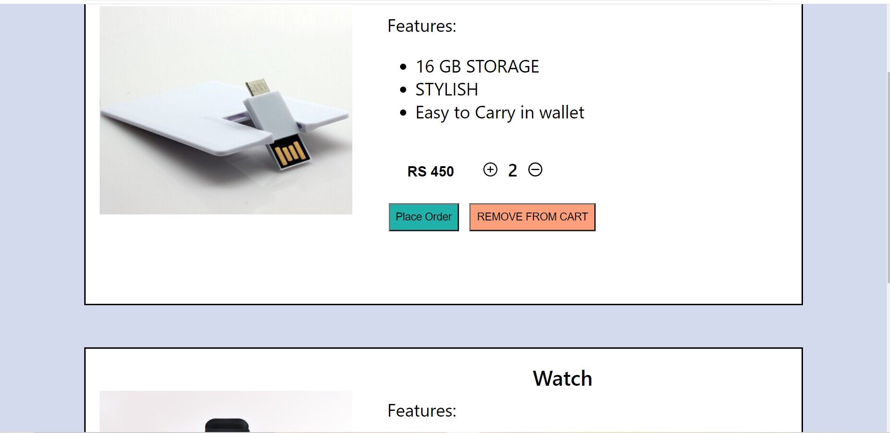
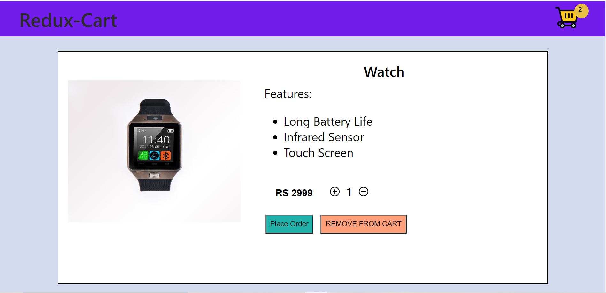
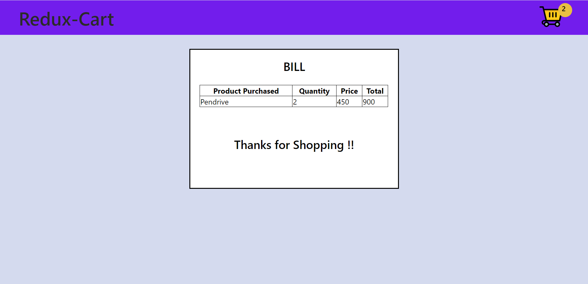

## Run Instructions:- 
<ul>
  <li>Clone the above repository.</li>
  <li>Use command npm install to download the dependencies. </li>
  <li>Give command npm start that will automatically start the app in the browser.</li>
</ul>

## Key Features:-
<ul>
  <li>Home Page listing all the available Products.</li>
  
  <li>Add/Remove Products in your cart.</li>
  <li>Cicking on the cart icon on the Navbar will list all the items present in the cart.</li>
   
  <li>Cicking on the Title on the Navbar will take you to the main homepage.</li>
  <li>Clicking on the image will display the details of the product</li>
  
  <li>Clicking on the buy option will generate the bill for that product.</li>
  
  
  
